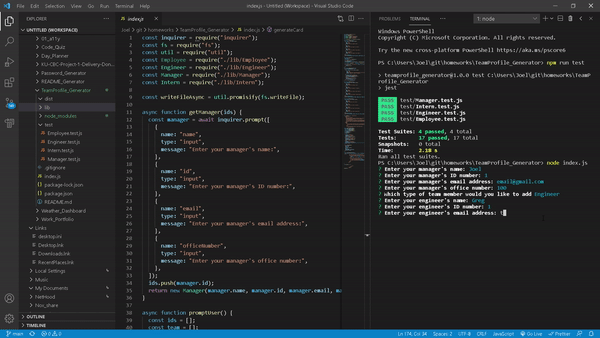

# <h1 align="center">Team Profile Generator</h1>

   
## Description
  
 A Node.js application that uses user input from inquirer and tests from jest to populate a HTML file for Team Members to keep track of. The HTMLtext file is created in the dist directory and can be found [here](.dist/team.html)

Below is the link to the video example of how it works:

[Video Presentation](https://drive.google.com/file/d/1visMqdRm8cTyzFmjrZ1ET8H9_KKODNWt/view?usp=sharing)

Here is a gif that higlights the creation of the Team Profile Generator  

## Table of Contents

- [Description](#description)
- [Installation](#installation)
- [Usage](#usage)
- [Contributing](#contributing)
- [Questions](#questions)

## Installation

`npm init`

`npm i inquirer`

`npm i jest`

## Usage

Run the following command at the root of your project and answer the prompted questions:

`node index.js`

`npm run test`

## Contributing

[Joel Stockard](https://github.com/jtstockard)

## Questions

Contact me with any questions: [email](jtstockard92@gmail.com) , [GitHub](https://github.com/jtstockard) 

    
    
    
    
    
    
